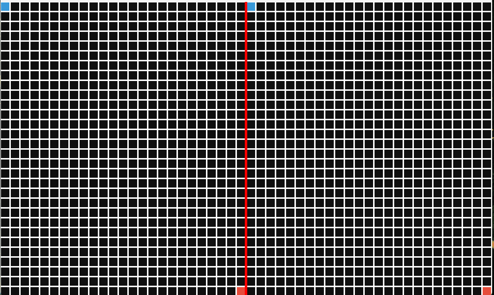

# Interactive Graph & Pathfinding Algorithm Arena



A real-time, interactive simulation sandbox built in native **C++17** using **SFML 3.1.0**. This application provides a side-by-side visual benchmarking environment to observe how structural graph generation algorithms and pathfinding heuristics navigate dynamically constructed maze spaces. 

The project features a highly decoupled, state-driven multi-file architecture that breaks down algorithmic steps incrementally to unblock the main render loop, enabling silky-smooth animations of underlying data structures.

---

## 🚀 Key Features

* **Side-by-Side Comparison:** View generation and solving phases side-by-side or isolate single viewports to track algorithm performance independently.
* **Incremental State-Driven Generation:**
  * **Randomized Depth-First Search (DFS):** Carves pathways using an explicit tracking stack.
  * **Kruskal’s Algorithm:** Utilizes a custom **Disjoint-Set Union (DSU / Union-Find)** data structure with path compression to calculate a randomized Minimum Spanning Tree layout devoid of isolated loops.
* **Concurrent Pathfinding Engines:**
  * **Breadth-First Search (BFS):** An uninformed radial search that floods the grid layer-by-layer to guarantee the shortest path.
  * **A\* Search:** An informed heuristic search optimized via custom priority queues biased heavily toward the target destination utilizing **Manhattan Distance**.
* **High-Contrast Custom Renderer:** Features bold, heavy-set white structural walls containing high-visibility exploration paths (**Vibrant Yellow** for BFS and **Hot Pink** for A\*).

---

## ⌨️ Sandbox Controls

Take full control of the sandbox in real-time with responsive keyboard mapping:

| Key | Action |
| :--- | :--- |
| **`G`** | Toggle Generation Mode (Swaps between **DFS** and **Kruskal's**) and triggers a fresh reset |
| **`R`** | Instant Refresh/Re-roll (Wipes the current canvas and generates a new random seed layout) |
| **`Space`** | Play / Pause the simulation at any point |
| **`Up Arrow`** | Increase calculation speed (decrease frame delay) |
| **`Down Arrow`** | Decrease calculation speed (increase frame delay) |
| **`S`** | Cycle View Mode (Sequentially toggles between Dual Arena, Isolated BFS, and Isolated A* views) |
---

## 🛠️ Compilation & Local Setup Guide

This project requires a C++17 compliant compiler and the **SFML 3.1.0** library. Follow these steps to build and run the executable locally on Windows:

### 1. Project Directory Structure
Ensure your project files are laid out cleanly as follows (excluding compiled binaries and external libraries from source control):
```text
your-repo-name/
│
├── main.cpp
├── Generators.cpp
├── Generators.hpp
├── Solvers.cpp
├── Solvers.hpp
├── Cell.hpp
├── .gitignore
└── README.md
```
### 2. Download Dependencies
1. Download **SFML 3.1.0** compiled for your specific toolchain (e.g., MinGW 64-bit).
2. Extract the library directly into your project root folder and name the folder `SFML-3.1.0`.

### 3. Build Command
Open PowerShell or your preferred terminal inside the root directory and run the multi-file compilation string:

```powershell
g++ -std=c++17 main.cpp Generators.cpp Solvers.cpp -o maze_app.exe -I"SFML-3.1.0/include" -L"SFML-3.1.0/lib" -lsfml-graphics -lsfml-window -lsfml-system
```
### 4. Link Dynamic Libraries
Before running the executable, copy the core `.dll` files from your `SFML-3.1.0/bin/` folder into your main root directory next to your newly created `maze_app.exe`:
* `sfml-graphics-3.dll`
* `sfml-window-3.dll`
* `sfml-system-3.dll`

### 5. Launch
Run the application via terminal:
```powershell
.\maze_app.exe
```
